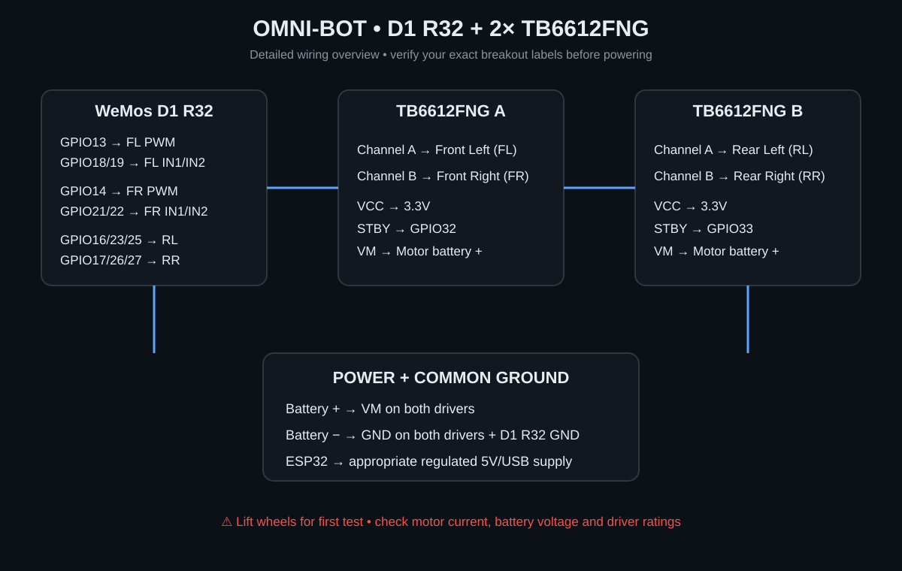
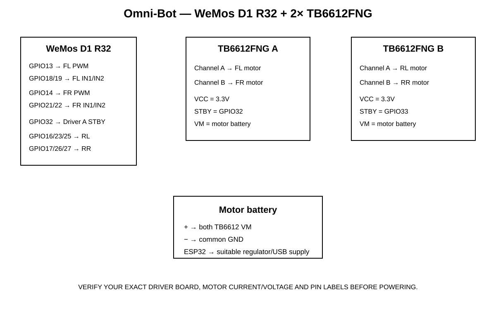

# 🚗 Omni-Bot
### WeMos D1 R32 • ESP32 • 4-Wheel Omni/Mecanum Drive • Wi-Fi Web Control

<p align="center"><strong>A compact, hackable ESP32 robot with browser-based control.</strong><br>No dedicated mobile app — connect to the robot and drive it from your phone.</p>



## ✨ What is Omni-Bot?
Omni-Bot is a four-wheel omni-directional robot built around the **WeMos D1 R32 (ESP32)**. Two dual-channel **TB6612FNG** motor drivers independently control the four motors, while the ESP32 hosts a lightweight Wi-Fi web interface for driving, speed adjustment, rotation and individual motor testing.

## 🧩 Core hardware
| Part | Role |
|---|---|
| **WeMos D1 R32** | Main controller + Wi-Fi |
| **2× TB6612FNG** | Four independent H-bridge channels |
| **4× DC gear motors** | Omni/mecanum drive |
| **Motor battery** | Motor power |
| **Regulated ESP32 supply** | Logic power |

> ⚠️ **Hardware note:** This repository assumes TB6612FNG breakout boards. Verify the exact board pin labels, motor voltage/current and battery voltage before connecting power.

## 🛞 Wheel layout
```text
                 FRONT
        ┌─────────────────────┐
        │   FL           FR   │
        │    \\           //   │
        │                     │
        │    //           \\   │
        │   RL           RR   │
        └─────────────────────┘
                  REAR
```
FL = Front Left · FR = Front Right · RL = Rear Left · RR = Rear Right

For the common **X-pattern mecanum configuration**, the roller orientation forms an X when viewed from above.

## 🎮 Movement model
X = forward/reverse · Y = lateral strafe · R = rotation

```text
FL = X - Y - R
FR = X + Y + R
RL = X + Y - R
RR = X - Y + R
```

Supported controls: **↑ ↓ ← → · ↖ ↗ ↙ ↘ · ↺ ↻ · STOP**

Individual FL / FR / RL / RR controls are included for commissioning and troubleshooting.

## 🔌 Wiring & schematics
### Block schematic


### Detailed wiring


### Pin map
| Motor | PWM | IN1 | IN2 | Driver |
|---|---:|---:|---:|---|
| FL | GPIO13 | GPIO18 | GPIO19 | A |
| FR | GPIO14 | GPIO21 | GPIO22 | A |
| RL | GPIO16 | GPIO23 | GPIO25 | B |
| RR | GPIO17 | GPIO26 | GPIO27 | B |

Driver A STBY → GPIO32 · Driver B STBY → GPIO33

TB6612 VCC → 3.3V logic · VM → motor battery · all grounds common.

> 🔴 Never power the motors from the ESP32 3.3V rail.

## 🌐 Web controller
The ESP32 creates its own Wi-Fi access point:

```text
SSID:      Omni-Bot
Password:  omnibot123
Address:   http://192.168.4.1
```

Features include a direction pad, diagonal movement, rotation, speed control, individual motor testing and stop control.

## 💻 Firmware
```text
firmware/
├── platformio.ini
└── src/
    └── main.cpp
```

Build with PlatformIO, upload over USB, connect to the Omni-Bot network and open the controller address.

### First power-up
1. Lift all wheels off the ground.
2. Power the controller and drivers.
3. Connect to the web interface.
4. Test every motor individually at low speed.
5. Verify physical direction and adjust inversion flags if necessary.
6. Test combined movement before placing the robot on the floor.

## 📁 Repository
```text
omni-bot/
├── README.md
├── docs/
│   ├── motor-positioning.md
│   ├── wiring.md
│   ├── schematic.svg
│   └── wiring-diagram.svg
└── firmware/
    ├── platformio.ini
    └── src/
        └── main.cpp
```

## ☕ Support
If this project helps you build something cool, you can support my work on **Ko-fi**.

<p align="center"><a href="https://ko-fi.com/himanshu18"></a></p>

This is the same Ko-fi linked from my **Cursed Archive** project.

## 📜 License
Released under the **MIT License**.

<p align="center"><sub>Made with ❤️ by Himeshbror18</sub></p>